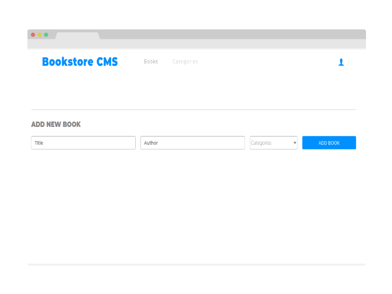

# Project Name

> Calculator

This Website is React Bookstore Project. You can add your books, follow your progress, categorize, add, and, of course, Delete.

## Built With

- HTML, CSS, JavaScript, ReactJS, Redux
- VS Code

## Live Demo

[Live Demo Link]()

## Getting Started

To get a local copy up and running follow these simple example steps.

### Prerequisites

- VSCODE

- OS with Git installed on it

- NPM

### Setup

**Run** 
git clone https://github.com/AmineHLub/book-store.git

npm start

**Test**

### Test

No testing available yet.

## Authors

👤 **Mohamed Amine Hajltaief**

- GitHub: [@AmineHLub](https://github.com/AmineHLub)
- Twitter: [@Amino47612441](https://twitter.com/Amino47612441)
- LinkedIn: [LinkedIn](https://www.linkedin.com/in/mohamed-amine-hajltaief-b18863163/)

## 🤝 Contributing

Any contributing is welcome

Feel free to check the [issues page](https://github.com/AmineHLub/math-magician/issues).

## Show your support

Give a ⭐️ if you like this project!

## Acknowledgments

- This project belongs to [Microverse](https://microverse.org/).

## 📝 License

- This project is [MIT](./Licenses/MIT.md) licensed.
